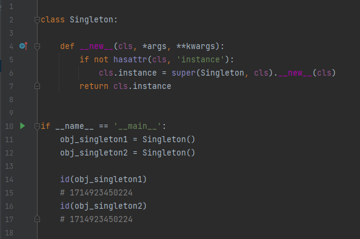
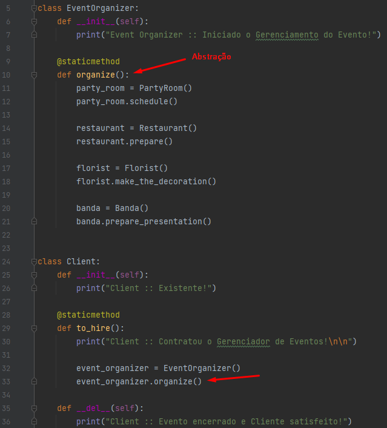

# Desing  Patterns - Python

## O que são padrões de projeto?

---
Os padrões de projetos são soluções para problemas conhecidos, eles podem ser utilizados
na análise ou no desing e, conforme esperado, na fase de desenvolvimento, por causa da relação direta com o código da aplicação.

#### Principais características dos padrões de projeto:
- São independentes de linguagem e podem ser implementados em linguagens diferentes;

- São dinâmicos, e novos padrões são introduzidos ou removidos ocasionalmente;

- São passíveis de personalização e, portanto, são úteis aos desenvolvedores;
---
## Tipos de padrão de projeto:

No livro GoF sobre padrões de projetos, discute-se 23 padrões de projetos, e os classificam em 
três categorias principais:

### Padrões de Criação:
- Funcionam com base no modo como os objetos podem ser criados;
- Isolam os detalhes da criação dos objetos;
- O código é independente do tipo do objeto a ser criado;
#### Exemplo: Singleton.

### Padrões de Estruturais:
- Determinam o design da estrutura de objetos e classes;
- O foco está em simplificar a estrutura e identificar o relacionamento entre classes e objetos;
- São centrados em heranças e composição de classes;
#### Exemplo: Adapter.

### Padrões Comportamentais:
- Se preocupam com a intenção entre os objetos e suas responsabilidades;
- Os objetos devem ser capazes de interagir e, mesmo assim, devem ter baixo acoplamento;
#### Exemplo: Observer.

---

## Singleton

Um dos padrões de projetos mais simples e conhecidos.
O Singleton proporciona uma forma de ter um, e somente UM, 
objeto de determinado tipo,
além de um ponto de acesso global a este objeto.

Exemplo de código:

### Vantagens do Pattern

### Onde usar Singleton?
Singleton deve ser utilizado com cuidado, pois nem sempre é útil ou necessário ter 
apenas uma instância de uma classe sendo compartilhada por toda a aplicação.

Recomendo utilizar o Singleton:

- Quando você precisar controlar a concorrência de acesso a recursos compartilhados;
- Quando uma classe for utilizada com frequência por várias partes distintas do sistema, 
e essa classe não gerencia nenhum estado da aplicação;
  
Como em uma classe de Logging, por exemplo.

---

## Factory

---

## Facade

---
É um padrão de projeto estrutural, ele oculta as complexidades da estrutura interna de um projeto oferecendo uma
interface ao cliente para que ele possa acessar o sistema de forma simplificada, podemos simplificar a utilização de um subsistema complexo apenas implementando uma classe que fornece uma interface única e mais razoável

Exemplo de código:

### Vantagens do Pattern

O Padrão Facade nos permite desconectar a implementação do cliente de qualquer subsistema. Assim, se quiséssemos acrescentar novas funcionalidades no subsistema é necessário apenas alterar a Facade ao invés de alterar diversos pontos do sistema. Além disso, o padrão Facade simplifica uma interface tornando-a muito mais simples, unificando um conjunto de classes mais complexas que pertencem a um subsistema.

### Onde usar o Facade?

O Padrão Facade é utilizado quando precisamos simplificar e unificar uma interface grande ou um conjunto complexo de interfaces. Uma das vantagens do padrão Facade é desconectar o cliente de um subsistema complexo. Um sistema pode ter diversos Facades simplificando diversos pontos do programa.

## Proxy

---

Exemplo de código:

### Vantagens do Pattern

O Padrão Proxy é um sistema que serve de intermediário entre o solicitante(seeker), e o provedor(provider). O solicitante
é quem faz a requisição, o provedor entrega os recursos em resposta à requisição.

### Onde usar o padrão Proxy?

O Padrão Proxy é utilizado quando precisamos...

## Observer

---

### Onde usar o padrão Observer?

#### Exemplos de casos de uso:
* Na implementação de um serviço de eventos em sistemas distribuídos;
* Na implementação de um sistema de notícias;
* No mercado de ações.

## Command 

---

## Template Method

---

## MVC (Model-View-Controller)

---

## State

---